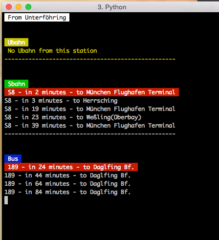
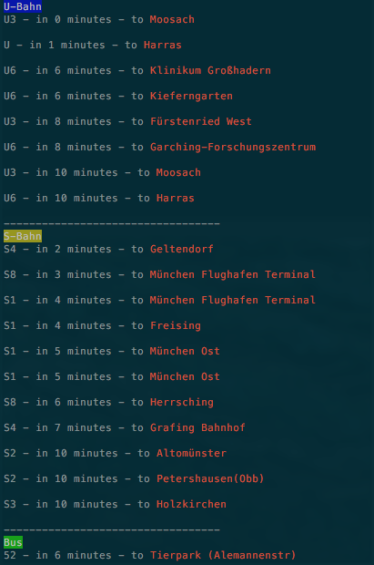

# MVG - Command Line Interface
Checkout the MVG-traffic data by querying the arriving/deperature data. You can find the CLI also in your favorite programing language.

| Language                   | Install                                                 | Usage            |
| -------------------------- | ------------------------------------------------------- | ---------------- | --------------------------
|     | `npm install mvg -g`                                    | `mvg [station]`  | [Preview](#node-preview), [Docs](nodejs/README.md)
|   | `git clone git@github.com:entwicklerstube/mvg-cli.git`  | `python mvg.py`  | [Preview](#python-preview), [Docs](python/README.md)
|     | `gem install mvg`                                       | `mvg [station]`  | [Preview](#ruby-preview), [Docs](ruby/README.md)

## Contribute
If you want the CLI in your programing language, just write it down and make a pull requests.
Wishes / suggestions are welcome :)

## Previews
### Node Preview

### Python Preview

### Ruby Preview

